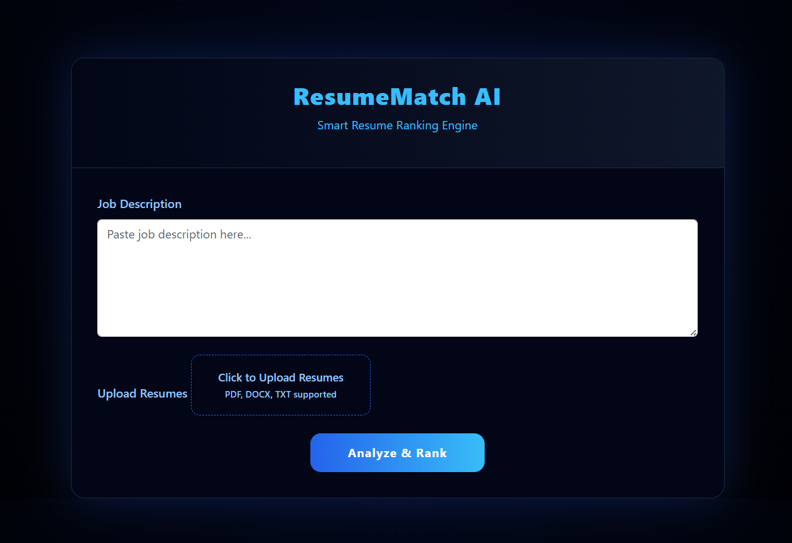

# ResumeMatch AI 
### ML-Based Resume Ranking System

ResumeMatch AI is a lightweight machine learning powered web application that analyzes a job description and ranks multiple resumes in bulk. It uses NLP techniques to calculate similarity and returns the top 3 most relevant CVs for faster and more efficient screening.


---

## 🚀 Features
- Upload multiple resumes (PDF, DOCX, TXT)  
- Paste any job description  
- AI-based matching using TF-IDF and Cosine Similarity  
- Ranks resumes based on relevance  
- Dark themed professional UI  
- Fast local processing  

---

## 🧠 Tech Stack

| Layer | Tools |
|------|------|
| Frontend | HTML, CSS, Bootstrap |
| Backend | Python, Flask |
| NLP Engine | Scikit-learn (TF-IDF, Cosine Similarity) |
| File Parsing | PyPDF2, docx2txt |
| Database | Local file system |
| Version Control | Git, GitHub |

---

## 📷 Screenshots

### Before


### After (AI Output)
.png)

---

## ⚙️ Installation & Setup

### 1. Clone the repository
```bash
git clone https://github.com/ThisAkshat/ResumeMatch-NLP-Based-Resume-Ranker.git
cd ResumeMatch-NLP-Based-Resume-Ranker
````

### 2. Install dependencies

```bash
pip install flask scikit-learn PyPDF2 docx2txt
```

### 3. Run the application

```bash
python main.py
```

### 4. Open in browser

```
http://127.0.0.1:5000
```

---

## 🧪 How It Works

1. User enters a job description
2. Uploads multiple resumes
3. System extracts text from each resume
4. TF-IDF converts text into vectors
5. Cosine similarity measures relevance
6. Top matching resumes are displayed with match percentage

---

## 📌 Use Case

* Resume screening for HR teams
* Candidate shortlisting
* AI-based hiring tools
* NLP learning project

---

## 👤 Author

Akshat Sharma
B.Tech Computer Science
AI, Backend Developer

---

## ⚠️ Note

This is a mini-project built for learning and demonstration purposes.
Future versions will include advanced NLP embeddings and cloud deployment.

